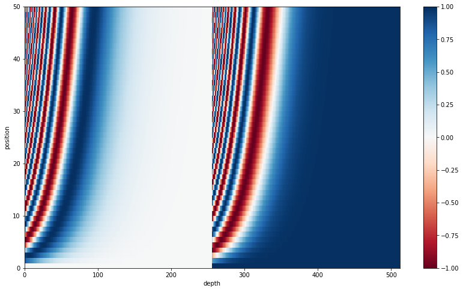
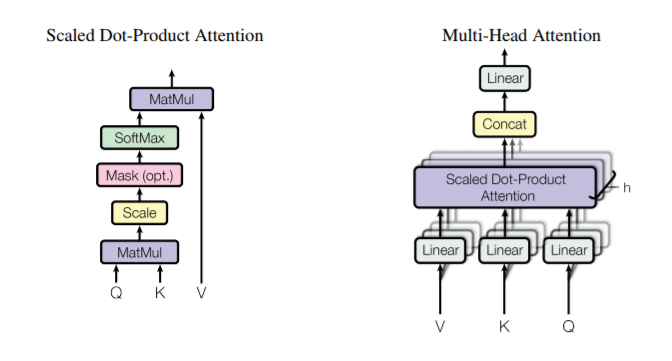
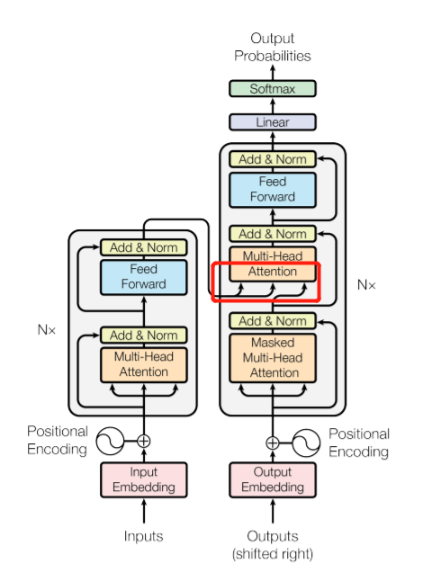

# transformer tensorflow-2.0 tutorial
tensorflow-2.0中关于transformer的tutorial. 虽然原文档关于实现细节已经足够详细，但对于一个完整的machine translation工程仍然有所欠缺。在这里我会对已有的知识作一个整理，并且对工程上的需要做一个补充和完善。  

- 数据处理的完整过程，包括BPE, tokenizer等；  
- BLEU 的计算；  
- tensorboard的可视化；  
- 模型的restore，save；


# requirement   
- tensorflow: 2.0  
- CUDA: 10.0  
- cudnn：7.5
- python: 3.6

# Quickly start  
- training:  

- testing:

# Model Architecture
## position encoding
- [position encoding tutorial1](https://github.com/PanXiebit/transformer-tf2.0/blob/master/model/tutoail-position-encoding.ipynb)  
- [position encoding tutorial2](https://github.com/tensorflow/examples/blob/master/community/en/position_encoding.ipynb)

$$\text{PE}_{(pos, 2i)}=sin(pos/1000^{2i/d_{model}})$$ $$\text{PE}_{(pos, 2i+1)}=cos(pos/1000^{2i/d_{model}})$$

对这个公式的理解是，将 position 和 dimension 看作是两个维度的矩阵，其对应的值是 angle，也就是三角函数中对应的部分
$$\text{pos*angle\_rads}=\text{pos} * (\text{min\_rate}^{(2*depth)/Depth})$$

这里 min_rate=1/1000. i=depth表示dimension的维度，pos表示在整个句子中的位置。Depth是总的dimension大小，论文中设置的是512.

但是上述用来表示pos和depth的式子，没有边界，因而加上sin/cos，将其范围压缩至[0,1]内。

position encoding 这样设计的目的是：  
1. 同一位置 position 的 angle_rate 是指数下降的，然后 wraps 正弦函数
2. 同一维度 dimension 的 angle_rate 是与 pos 成正比，然后 warps 正弦函数
1. 保证绝对位置相邻的 vector 是相似的  
2. 保证相对位置的 vector 是线性关系。 $PE_{pos_k}=k(PE_{pos})$

## multi-head Attention
**multi-head attention 分成四步：**

- Linear layers and split into heads.  
- Scaled dot-product attention.  
- Concatenation of heads.  
- Final linear layer.

**为什么要使用 multi-head？**  

Instead of one single attention head, Q, K, and V are split into multiple heads because it allows the model to jointly attend to information at different positions from different representational spaces. After the split each head has a reduced dimensionality, so the total computation cost is the same as a single head attention with full dimensionality.



### scaled dot product attention  

输入是 Q (query), K (key), V (value)， 输出是：
$$Attention(Q,K,V)=softmax_k(\dfrac{QK^T}{\sqrt{(d_k)}})V$$

- Q: [batch, q_len, d_model]
- K: [batch, kv_len, d_model]
- V: [batch, kv_len, d_model]

这里除以 d_model 是避免向量内积之后数量级太大。softmax 之前各个值的大小差距太大(方差变大)，而通过 softmax 之后得到的 probability 变化不大(hard softmax)，导致梯度变化很小.

举个例子，如果 Q 和 K 都是均值为0，方差为1的分布，他们的矩阵相乘之后的分布是均值为0，方差为 $d_k$. 方差变大意味着distribution之间不同元素的值差距变大，也就是上面说到的 hard softmax. 因此除以 $\sqrt d_k$ 之后，得到的分布依旧是均值为0，方差为1，这样我们能得到一个 genter softmax.
$$q\cdot k=\sum_{i=1}^{d_k}q_ik_i$$

### mask in attention  
注意这里在求sftmax时需要先进行mask. 关于attention中的mask有三种情况。  

1) encoding 阶段对于 source 端的 padding  mask    
2) decoder 阶段 self-attention 部分的 masked-multi-head attention,这里不仅包括 padding mask，还包括 look ahead mask  
3) decoder 阶段 encoder_ouput 和 attented target 的交互 attention,这里仅仅包括 padding mask，而且与第一阶段一致，因为是 encoder output 作为 key 和 value 值. attented target 是 query.

```python
# padding mask
def create_padding_mask(seq):
    seq = tf.cast(tf.math.equal(seq, 0), tf.float32)
    # add extra dimensions so that we can add the padding
    # to the attention logits.
    return seq[:, tf.newaxis, tf.newaxis, :]  # [batch_size, 1, 1, seq_len]

# look-ahead mask
def create_look_ahead_mask(size):
    mask = 1 - tf.linalg.band_part(tf.ones((size, size)), -1, 0)
    return mask   # (seq_len, seq_len)

def create_mask(inp, tgt):
    """ 这里总共要计算三种 masking，
    第一种是 encoding 阶段对于 source 端的 padding  mask
    第二种是 decoder 阶段 self-attention 部分的 masked-multi-head-attention,这里不仅包括 padding mask，还包括 look ahead mask
    第三种是 decoder 阶段 encoder_ouput 和 attented target 的交互 attention,这里仅仅包括 padding mask，而且与第一阶段一致，因为是 encoder output
        作为 key 和 value 值. attented target 是 query.

    :param inp:  [batch, inp_seq_len]
    :param tgt:  [batch, tgt_seq_len]
    :return:
    """
    # 第一种masking: encoding padding mask
    enc_padding_mask = create_padding_mask(inp)  # [batch, 1, 1, inp_seq_len]

    # 第三种masking: decoding padding mask
    # Used in the 2nd attention block in the decoder.
    # This padding mask is used to mask the encoder outputs.
    dec_padding_mask = create_padding_mask(inp)  # [batch, 1, 1, inp_seq_len]

    # 第二种masking: combined mask
    # Used in the 1st attention block in the decoder.
    # It is used to pad and mask future tokens in the input received by
    # the decoder.
    look_ahead_mask = create_look_ahead_mask(tf.shape(tgt)[1])   # [tgt_seq_len, tgt_seq_len] 上三角都为1，下三角（包括对角线）都为0
    dec_targrt_padding_mask = create_padding_mask(tgt)           # [batch, 1, 1, tgt_seq_len]
    combined_mask = tf.maximum(dec_targrt_padding_mask, look_ahead_mask)    # [batch, 1, tgt_seq_len, tgt_seq_len]
    # 对 [batch, 1,1, tgt_Seq_len] 第三个维度广播之后,然后再进行计算。不仅mask了future信息，还mask对应序列中的padding词
    return enc_padding_amsk, combined_mask, dec_padding_mask
```
所以 enc_padding_mask 和 dec_padding_mask 其实是一样的。关于mask实现可以查看 [tutorial-masking](https://github.com/PanXiebit/transformer-tf2.0/blob/master/model/tutorial-masking.ipynb)

## encoder-decoder
知道了 multi-head Attention, encoder-decoder 的实现就很简单了。以及 [layer normalization](https://github.com/PanXiebit/transformer-tf2.0/blob/master/model/layer_norm.py) 的实现。

###  
